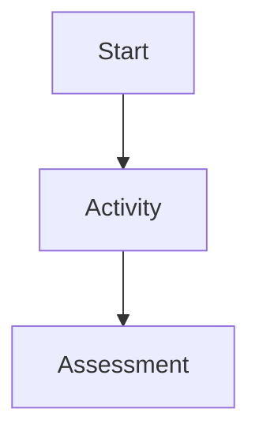

# Course Content Generator: Instructor User Manual

## Purpose

Course Content Generator helps an instructor turn a course brief into a reviewed curriculum, develop individual instructor-ready lessons, and export an approved course. It is an authoring tool: you remain responsible for factual accuracy, learner safety, licensing, accessibility, and teaching quality.

## Before you begin

You need an account created by an administrator. There is currently no self-registration or password-reset screen.

For AI generation to work, an administrator must first:

1. Create and enable a provider and at least one model in **Generation settings**.
2. Select an enabled default provider and model.
3. Set that provider's API-key environment variable on the server.
4. Ensure the Celery worker and Redis are running.

The application never asks an instructor to enter an API key. If generation is not configured, the course can still be created and edited manually.

## Instructor workflow

```text
Create course brief
        ↓
Review generated curriculum (or create it manually)
        ↓
Approve one curriculum version
        ↓
Generate and refine each lesson
        ↓
Export the approved course
```

## 1. Sign in and find your work

1. Open the application and sign in. The dashboard now shows recent owned courses and recent generation/export activity.
2. Select **Courses** in the navigation to see the complete course list. Each card shows the active approved duration (or the latest proposed/requested duration), lesson completion for the active approved curriculum, and when the course was last updated.
3. Select a course title to open its overview.

The course list shows its title, topic, level, requested duration, status, and number of curriculum versions. Other users cannot view or download your courses, jobs, or exports.

## 2. Create a course brief

1. Select **Create a course**.
2. Enter a clear title and topic. Add the intended audience, learner level, language, delivery mode, and learning outcomes.
3. Enter a duration in minutes when the course has a fixed schedule. Leave it blank when you want the planner to propose a duration.
4. Add prerequisites, required tools, constraints, and instructor notes where useful.
5. Submit the form.

The application creates the course and queues curriculum planning when a default model is available. A queued course normally shows **Planning**; after a valid plan is generated it becomes **Ready for review**.

### Write a useful brief

- State the learner level and prior knowledge: “intermediate Python developers who know functions and lists.”
- State the delivery setting: “a 4-hour instructor-led workshop with 30 minutes for exercises.”
- Put non-negotiable technologies or policies in **Constraints**.
- Phrase learning outcomes as observable actions, one per line: “Build a form,” “Explain CSRF protection,” “Debug a validation error.”

## 3. Review and approve a curriculum

From the course overview, select **Review** beside a curriculum version.

The review page presents the requested duration, AI-proposed duration, calculated lesson total, an estimate explanation, overall learning outcomes, prerequisites, ordered sections, lessons, and any course project. You have three choices:

- **Approve curriculum** makes that version the active approved curriculum. If another version was approved, it is retained but marked superseded.
- **Queue revision** sends a focused instruction to the AI, for example: “reduce this to a two-hour workshop for beginners; retain only one hands-on exercise.”
- **Create revised copy** opens the manual curriculum editor.

Approval does not destroy previous versions. Review the structure, durations, outcomes, learner load, and overall project before approving.

Every curriculum approval page, lesson workspace, and export area includes the same optional **Instructor review checklist**. Before approving or exporting, verify factual accuracy, learner suitability, accessibility, licensing/copyright, privacy, code correctness, and assessment quality. AI output is a draft for your review; the checklist is advisory and never blocks editing or generation.

### Compare or restore a previous curriculum

When a course has at least two curriculum versions, select **Compare versions** from the course overview. Choose two versions to see their planning details, sections, lessons, and project side by side; changed rows are highlighted.

To return to a historical plan, open that version and select **Restore as new draft**. This never reactivates or edits the historical version. Instead, it creates a new draft copy that you must review and approve through the normal workflow.

## 4. Manually edit a curriculum

The manual editor uses an ordered JSON array plus planning fields for the course description, overall learning outcomes, prerequisites, proposed duration, duration-estimate explanation, and an optional overall course project. Array order becomes the section and lesson order. Every section needs at least one lesson, and each section duration must equal the sum of its lesson durations. If you enter a proposed duration, it must equal the calculated lesson total.

To create or revise the overall project, enter an optional JSON object in **Project JSON**. It is copied only into the newly created curriculum version; the previous project remains unchanged.

```json
{
  "title": "Build a learning journal",
  "description": "Create a small application that applies the course concepts.",
  "deliverables": ["Source repository", "Short implementation guide"],
  "evaluation_criteria": ["Runs successfully", "Uses the required concepts"]
}
```

Example:

```json
[
  {
    "title": "Django foundations",
    "summary": "Set up the project and explain the request cycle.",
    "learning_outcomes": ["Create a Django project"],
    "duration_minutes": 60,
    "lessons": [
      {
        "title": "Project setup",
        "objectives": ["Create and run a project"],
        "outline": "Create a virtual environment, install Django, and run the server.",
        "duration_minutes": 30
      },
      {
        "title": "The request cycle",
        "objectives": ["Explain URL routing and views"],
        "outline": "Trace a browser request to a response.",
        "duration_minutes": 30
      }
    ]
  }
]
```

To reorder material, move objects within the arrays. To add or remove a section or lesson, add or remove its object and update durations. Save the form to create a new draft version, then review and approve it.

## 5. Generate and refine lessons

1. Open the approved course’s **workspace**.
2. Select a lesson from the curriculum sidebar.
3. Select **Generate lesson** for a first draft, or open **Revise with AI** and give targeted instructions. To generate several lessons, select their checkboxes in the approved curriculum sidebar and choose **Generate selected lessons**. Lessons that already have queued, running, or retrying generation are skipped and named in a message, so a second active job is not created.
4. Watch the status panel. A job may be queued, running, succeeded, failed, cancelled, or need review.
5. For a failed or needs-review job, use **Retry**. For an active job, select **Cancel generation**. The course overview also shows curriculum planning jobs with live status, cancellation, and retry controls.

Generated lesson content is saved as an immutable revision. Each accepted AI response must provide objectives, expected duration, preparation and materials, a timed teaching flow, concepts, examples, activities, assessment with expected answers or a rubric, common misconceptions, and an optional project connection. The application turns that structured plan into editable Markdown and retains the structured lesson-plan data with the revision. If the model omits any required element, it is asked for a complete replacement up to the configured continuation limit; then the job is marked **Needs review**. The workspace renders Markdown safely; scripts and unsafe links are removed before display.

### Add a Mermaid diagram

Use an explicitly labelled Mermaid fenced block in lesson Markdown. The diagram source is shown as readable code until the locally bundled renderer succeeds, so it remains usable when JavaScript is unavailable or a diagram contains an error.

```text

```

Only these fenced blocks are eligible for diagram rendering. Do not paste script tags or arbitrary HTML; the workspace removes unsafe HTML and unsafe links.

### Edit a lesson yourself

1. Open **Edit lesson content** below the lesson.
2. Write or paste Markdown.
3. Add a short change summary, such as “Added expected answers for exercise 2.”
4. Select **Save new revision**.

The revision history records each revision number, timestamp, and summary. Select any revision to safely view the historical Markdown. Choose **Restore as new revision** there to append a copy as the latest revision; historical content is never overwritten. Use the most recent content as the current instructor draft.

### Review lesson quality before teaching

Check each lesson for:

- an achievable objective and realistic duration;
- preparation, materials, examples, and expected learner output;
- accurate code, commands, terminology, and links;
- activities that match the learner level;
- an assessment/check for understanding and an expected answer or rubric;
- accessibility, copyright, privacy, and organizational-policy requirements.

## 6. Export an approved course

The course overview shows **Export approved content** only after a curriculum has been approved.

1. Choose Markdown, Word document, or PDF.
2. Select **Queue export**.
3. Wait for the background export job to complete.

Exports are private files owned by the course owner. Markdown, DOCX, and PDF exports preserve the approved curriculum order, lesson titles, latest lesson revision content, and an available course project. The course overview polls export status while work is active, shows safe error messages, and displays **Download** only when complete. You can cancel a queued export before rendering starts, or retry a failed export; completed and cancelled jobs are terminal.

## Administrator guide

Only staff users can open **Generation settings**.

1. Add a provider with its adapter type, a descriptive name, and the name of its API-key environment variable.
2. For OpenAI-compatible services, add the required base URL.
3. Add one or more models under that provider; enable only models approved for use.
4. Select the enabled default provider/model and set temperature, output limit, timeout, retry count, and continuation limit.
5. Confirm the page reports the key as configured.

Do not paste provider keys into the application, course notes, or logs. Set them only in the deployment platform’s secret manager/environment.

## Troubleshooting

| Symptom | What to check |
| --- | --- |
| “Configure an enabled default model” | Ask an administrator to enable a provider/model and select it as default. |
| A job stays queued | Confirm Redis and a Celery worker for this release are running. |
| A job fails | Read the safe error message, correct the brief or provider configuration, then retry. |
| A job needs review | The model output did not satisfy the required schema after the configured continuation limit. Edit manually or submit a more focused request. |
| Export is unavailable | Approve a curriculum first, then queue a new export. |
| You receive a 404 for a course/job/export | You may not own that resource, or its identifier is invalid. |

## Current feature boundaries and known gaps

This section records features described in the product documents that are not yet delivered in the user interface or are only partially delivered.

| Area | Current state | Missing capability |
| --- | --- | --- |
| Dashboard | Recent owned courses and recent generation/export activity are displayed | It does not yet provide aggregate analytics or filtering. |
| Curriculum duration | The review page displays requested duration, proposed duration, calculated lesson total, and the estimate rationale | It does not yet show per-section percentage allocation. |
| Curriculum editing | Full create/reorder/add/remove is available through JSON | There is no visual drag-and-drop or field-by-field section/lesson editor. |
| Curriculum versions | Draft/approved/superseded versions are retained; owners can compare two versions and restore a historical version as a new draft | There is no visual merge tool for combining portions of two versions. |
| Projects | AI and manual curriculum versions can persist an overall `CourseProject`, display it in review/workspace, and include it in exports | Section-level project examples are not modeled. |
| Lesson generation | Individual and selected-lesson batch generation, AI revision, retry, cancellation, manual revisions; generated lessons require a structured instructional plan and are rendered into editable Markdown | There is no whole-course automatic generation schedule. |
| Diagrams and media | Markdown is safely rendered | Mermaid is not rendered as a diagram, and the product does not generate images, slides, video, or other media assets. |
| Revision history | Revision numbers and summaries are listed; owners can safely view and restore historical revisions as new immutable copies | There is no visual diff between two lesson revisions. |
| Curriculum job controls | Curriculum jobs are persisted and have a JSON status endpoint | The course overview does not show curriculum job progress or provide retry/cancel controls. |
| Exports | Private Markdown/DOCX/PDF files, course export history, and completed-download links exist | The UI does not auto-refresh export progress and has no export cancellation control. |
| Accounts | Login/logout and ownership isolation | There is no self-registration, password reset, team roles, collaboration, or comments. |
| Reporting | Jobs and attempts are stored | The success metrics and operational dashboards in the PRD are not implemented. |

These gaps do not prevent the core single-instructor workflow, but they should be planned before claiming full PRD completion.
